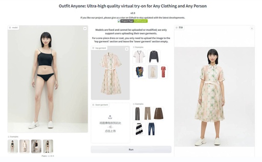

#周刊 #今日分享周刊 #AIGC #AIGC周刊

> 今日分享 AIGC 周刊 #002：OutfitAnyone AI - 适用于任何服装和任何人的超高品质虚拟试穿；Qwen - 阿里云的大模型；Llm-Universe - 《动手学大模型应用开发》；Google Chrome突破性更新：一键访问Gemini功能；StoryDiffusion - 高质量开源漫画生成，支持连续人物，多种漫画风格

## 🛠 开源前线

### OutfitAnyone AI - 适用于任何服装和任何人的超高品质虚拟试穿

一个模特换衣的 AI 模型，只要上传服饰平铺图，就可以生成模特的试衣结果

GitHub: https://github.com/ihmily/outfit-anyone

### Qwen - 阿里云的大模型

Qwen 是由阿里云提出的聊天和预训练大型语言模型的官方存储库

GitHub: https://github.com/QwenLM/Qwen

### Llm-Universe - 《动手学大模型应用开发》

该项目是专为小白开发者设计的大模型应用开发教程。内容涵盖了大模型的概念介绍、如何调用大模型API、知识库的搭建、构建 RAG（Retrieval-Augmented Generation）应用以及评估方法等内容。

GitHub: https://github.com/datawhalechina/llm-universe

### DynamiCrafter - 自媒体制作短视频神器

可实现任意类型静态图像转化为逼真动态视频。它是一款能够利用预先训练的视频扩散先验，根据文本提示对开放域静止图像进行动画处理的工具。通过这个工具，用户可以将静态图像转换为动态的视频，从而赋予图片更多生动性和趣味性。

GitHub：https://github.com/Doubiiu/DynamiCrafter

### SadTalker - 基于音频驱动的单幅图像对话头像动画生成项目

它可以将单幅人像图像与音频结合，生成逼真的视频对话头像。

GitHub: https://github.com/OpenTalker/SadTalker

## 📘 技术文章

### 联手 Copilot，我在10个小时内上线了一个前端网站

作者只有前端基础，通过使用 GitHub Copilot，在短时间内完成一个 React 前端项目，并总结了一些使用 Copilot 的技巧。

文章：https://ameow.xyz/archives/develop-a-frontend-site-with-copilot

### Google Chrome突破性更新：一键访问Gemini功能

昨天的文章刚说到 Gemini的一些更新，这不，Google Chrome 又一项突破性更新，该更新通过简单的“@”符号启用，可以直接访问智能AI助手Gemini。

https://mp.weixin.qq.com/s/e07cgcLCSpm_NflVAPUXhQ

### 国产 Sora 竞争关键，在创意、工作流和垂直场景 

AI加持，只用半天，就能做出时长60秒的惊艳短片；面对越来越激烈的竞争，创意超越现实、工作流的整合、垂直场景能力这三点非常关键；垂直模型的创新，有两年左右的窗口期；美图不做大而全的模型和场景，更关注垂直的图像和视频模型及场景

https://mp.weixin.qq.com/s/TFvwXWsC9k76OyO_5FD_JA

### StoryDiffusion - 高质量开源漫画生成，支持连续人物，多种漫画风格

StoryDiffusion 是由字节跳动和南开大学合作推出的一款AI工具，专注于长范围图像和视频生成。它利用一致性自注意力机制来实现图像和视频内容的连续性和一致性，特别适合生成长篇漫画或带连续剧情的视频。

https://mp.weixin.qq.com/s/rsLse1vkh88A_rp_h53ySA

## 👨‍👩‍👧‍👦  一起成长
进入分享群，每日分享新技术、新资讯，每天 1 分钟，帮助你强制学习，1 年就算 365 个知识点，助你早日成为大神，财务自由。

添加我，备注「今日分享 - AIGC」
