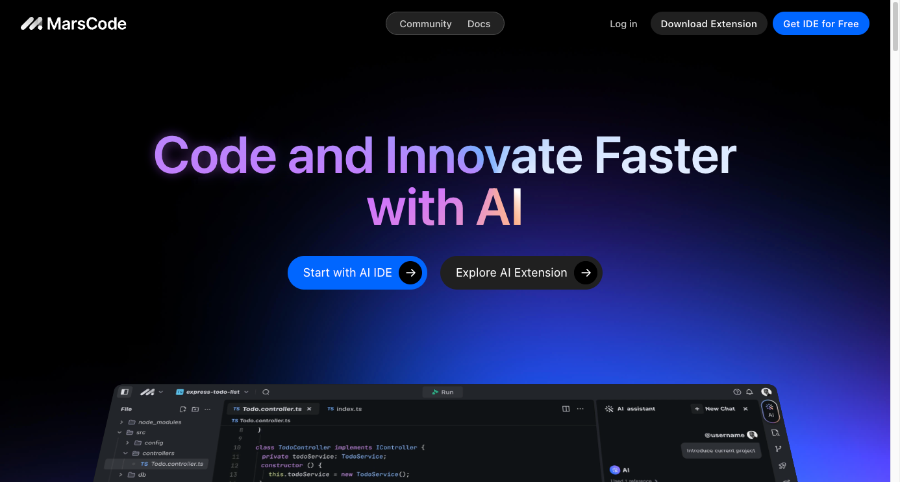

#周刊 #今日分享周刊 #AIGC #AIGC周刊

> 今日分享 AIGC 周刊 #003：MarsCode - 字节新推出的 AI 编程助手，GitHub Copilot 替代品；手把手教你创造你的本地私人 ChatGPT（上）：本地大模型 Ollama；DeepSeek-V2 - 国产开源 MoE 指标炸裂，GPT-4 级别能力，API 价格仅百分之一；OpenAI 官宣下周一发布产品更新，但不会涉及 GPT-5 和搜索引擎

## 🛠 开源前线

### Ollama - 本地运行各种 LLM 的工具

这是一个用 Go 语言写的工具，用于在本地一条命令安装、启动和管理大型语言模型，支持 Llama 3、Gemma、Mistral 等大模型，适用于 Windows、macOS、Linux 操作系统。

GitHub: https://github.com/ollama/ollama

### 当AI遇上爬虫：ScrapeGraphAI结合LLM实现前所未有的网页抓取效率，一言即搜

在当今数据驱动的世界中，网络抓取已成为从广阔的互联网中收集信息的重要工具。然而，传统的网络抓取工具往往难以适应网站的动态特性，需要开发人员不断维护和更新。

GitHub: https://github.com/VinciGit00/Scrapegraph-ai

## 📘 技术文章

### AI人才争夺战，华尔街入局：豪掷百万美元年薪抢人

奉上一组“最热Top 5岗位”薪酬数据：
AI/机器学习工程师：最高年薪30万美元（约217万元）
云安全leader：最高年薪30万美元（约217万元）
AI产品经理/工程经理：最高年薪65万美元（约470万元）
技术和运营leader：最高年薪七位数（单位：美元；未公布具体数值）
AI运营高管：最高年薪200万美元（约1448万元）

https://mp.weixin.qq.com/s/FKrW9Tf8LZbjc1vd-BddBw

### DeepSeek-V2 - 国产开源 MoE 指标炸裂，GPT-4 级别能力，API 价格仅百分之一

DeepSeek-V2 性能达 GPT-4 级别，但开源、可免费商用、API 价格仅为 GPT-4-Turbo 的百分之一。从公布的性能指标来看，DeepSeek-V2 的中文综合能力超越一众开源模型，并和 GPT-4-Turbo、文心 4.0 等闭源模型同处第一梯队。英文综合能力也和 LLaMA3-70B 同处第一梯队，并且超过了同是 MoE 的 Mixtral 8x22B。

https://www.jiqizhixin.com/articles/2024-05-07-3

### 我如何夺冠新加坡首届 GPT-4 提示工程大赛

1. 借助 CO-STAR 框架构建高效的提示
2. 利用分隔符来分节构建提示
3. 设计含有 LLM 保护机制的系统级提示
4. 仅依靠大语言模型分析数据集，无需插件或代码  — 实际案例分析 Kaggle 的真实数据集

https://baoyu.io/translations/prompt-engineering/how-i-won-singapores-gpt-4-prompt-engineering-competition

### OpenAI神秘模型，再次被Sam Altman提及

5月6日，OpenAI首席执行官Sam Altman在社交平台分享了一条推文“我是一个优秀的GPT-2聊天机器人”。
而在4月30日，Altman就提起过该模型非常喜欢GPT-2。按道理说一个只有15亿参数在2019年发布的开源模型，被反复提及两次就很不寻常。

https://mp.weixin.qq.com/s/6JgHlShBMiZ8UYInLr6vVg

### MarsCode - 字节新推出的免费 AI 编程助手，支持 WebIDE 和 VSCode

它提供了 AI 驱动的云端 WebIDE 版和支持 VSCode 和 JetBrains 等的扩展插件版。MarsCode IDE 具备代码补全、生成、解释功能，支持 AI 问答和 BUG 修复功能。MarsCode还提供 AI 插件开发与部署工具，简化了 API 测试、存储管理和 Schema 管理。此外，它拥有一键部署功能，提供安全可靠的云开发环境，支持多种项目创建方式，无需配置即可开始开发，确保了快速稳定的开发体验。

https://www.marscode.com/

### 大模型卷爆数字人：一句话5分钟实现定制，跳舞主持带货都能hold住

最快5分钟，打造一个直接上岗工作的3D数字人。这是大模型给数字人领域带来的最新震撼。就像这样，一句话描述需求：生成的数字人直接就能进驻直播间当主播。

文章：https://mp.weixin.qq.com/s/E0S6i6dSNKWwAV9XtSmC7A

### 通义千问 2.5 正式发布，性能全面赶超GPT-4

今天，阿里云正式发布通义千问 2.5，号称 “能力升级，全面赶超 GPT-4”，并开源通义千问 1100 亿参数模型 Qwen1.5-110B。
据介绍，与通义千问 2.1 版本相比，2.5 版本模型的理解能力提升了 9%，逻辑推理提升了 16%，指令遵循提升了 19%，代码能力提升了 10%。在中文语境下，通义千问 2.5 文本理解、文本生成、知识问答及生活建议、闲聊及对话、安全风险等多项能力赶超 GPT-4。

https://mp.weixin.qq.com/s/0WLYJ14pj55A1aJLoYItMw

### 手把手教你创造你的本地私人 ChatGPT（上）：本地大模型 Ollama

近年来，人工智能技术发展迅猛，其中大型语言模型（LLM）的进步尤为引人注目。LLM 拥有海量的参数和强大的学习能力，能够执行各种复杂任务，例如生成文本、翻译语言、编写不同类型的创意内容等等。以往，想要体验 LLM，通常需要将模型部署到云端，这对于个人用户来说门槛较高，且成本不菲。现在，Ollama 的出现打破了这一限制。

https://mp.weixin.qq.com/s/JfC-bZRfeAtM7OG2dHD2rg

### OpenAI 官宣下周一发布产品更新，但不会涉及 GPT-5 和搜索引擎

5月10日，OpenAI表示，将于5月13日（下周一）上午10点在其官网进行直播，届时将演示一些ChatGPT和GPT-4更新。不过，OpenAI首席执行官萨姆·奥尔特曼在X上转发了公司这条帖子，并补充道：“不是GPT-5，也不是搜索引擎，但我们一直在努力开发一些我们认为人们会喜欢的新东西！对我来说感觉就像魔术一样神奇。”奥尔特曼的帖子在某种程度上回应了路透社早些时候的报道。路透社此前报道称，OpenAI计划于下周一发布一款由AI驱动的搜索引擎产品，与搜索引擎霸主和AI搜索初创公司Perplexity展开竞争。不过，报道也指出，公布的日期可能会有变化。

https://m.163.com/news/article/J1T37PF500097U7T.html

## 👨‍👩‍👧‍👦  一起成长
进入分享群，每日分享新技术、新资讯，每天 1 分钟，帮助你强制学习，1 年就算 365 个知识点，助你早日成为大神，财务自由。

关注微信公众号，添加我，备注「今日分享 - AIGC」

